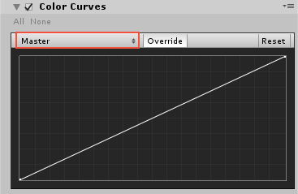

# Color Curves

Grading curves are an advanced way to adjust specific ranges in hue, saturation, or luminosity. You can adjust the curves in eight available graphs to achieve effects such as specific hue replacement or desaturating certain luminosities.

## Using Color Curves

**Color Curves** uses the [Volume](Volumes.html) framework, so to enable and modify **Color Curves** properties, you must add a **Color Curves** override to a [Volume](Volumes.html) in your Scene. To add **Color Curves** to a Volume:

1. Select the Volume component in the Scene or Hierarchy to view it in the Inspector.
2. In the Inspector, navigate to **Add Override > Post-processing** and click on **Color Curves**. HDRP now applies **Color Curves** to any Camera this Volume affects.

## Properties

| **Curve**      | **Description**                                              |
| -------------- | ------------------------------------------------------------ |
| **Master**     | This curve affects the luminance across the whole image. The x-axis of the graph represents input luminance and the y-axis represents output luminance. You can use this to further adjust the appearance of basic attributes such as contrast and brightness across all color channels at the same time. |
| **Red**        | This curve affects the red channel intensity across the whole image. The x-axis of the graph represents input intensity and the y-axis represents output intensity for the red channel. |
| **Green**      | This curve affects the green channel intensity across the whole image. The x-axis of the graph represents input intensity and the y-axis represents output intensity for the green channel. |
| **Blue**       | This curve affects the blue channel intensity across the whole image. The x-axis of the graph represents input intensity and the y-axis represents output intensity for the blue channel. |
| **Hue Vs Hue** | This curve shifts the input hue (x-axis) according to the output hue (y-axis). You can use this to fine tune hues of specific ranges or perform color replacement. |
| **Hue Vs Sat** | This curve adjusts saturation (y-axis) according to the input hue (x-axis). You can use this to tone down particularly bright areas or create artistic effects such as monochromatic except a single dominant color. |
| **Sat Vs Sat** | This curve adjusts saturation (y-axis) according to the input saturation (x-axis). You can use this to fine tune saturation adjustments made with [Color Adjustments](Post-Processing-Color-Adjustments.html). |
| **Lum Vs Sat** | This curve adjusts saturation (y-axis) according to the input luminance (x-axis). You can use this to desaturate areas of darkness to provide an interesting visual contrast. |